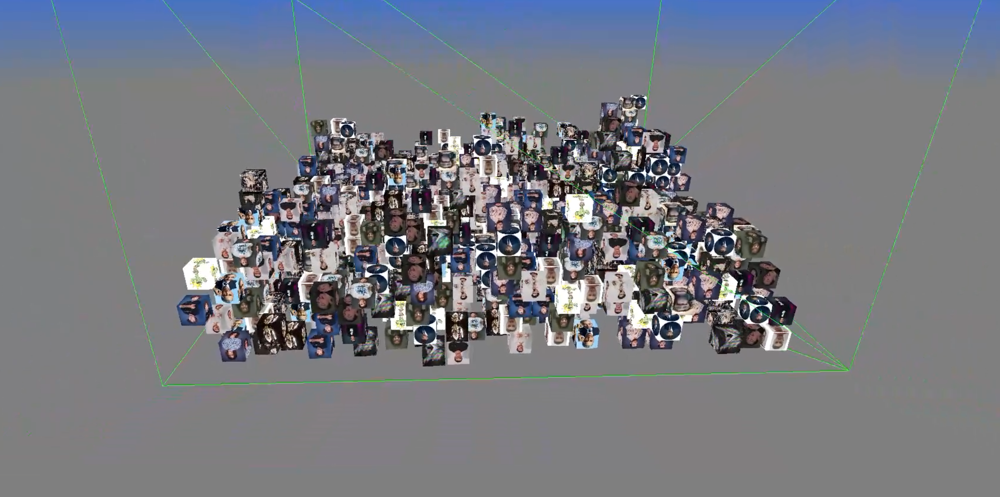

# Advanced Physic

### THIS PROJECT WAS THE WORK OF 3 PEOPLE BUT I COULDN'T FORK THE ORIGINAL REPO DUE TO MY SCHOOL'S ORGANIZATION
### OTHER CONTRIBUTORS :
- [REAPERtmm](https://github.com/REAPERtmm)
- [Skaro971](https://github.com/Skaro971)

---

### General Information 
**Advanced Physic** (`PhysicAdvanced`) is a 3D C++ physics engine developed using **OpenGL 4.3**, **GLFW**, and custom sub-libraries (`TMM_Threading`, `TMM_Functional`, and `TMM_Setup`) made by REAPERtmm.  
The project focuses on real-time 3D rendering, GPU-accelerated compute shader physics, water simulation, and custom multithreaded architecture.

**Technologies used:**
- C++20
- OpenGL 4.3 (Compute Shaders, GLAD)
- GLFW 3.4
- GLM 1.0.1 (OpenGL Mathematics)
- stb (Texture loading)
- CMake (>= 3.23) for build management & FetchContent

---

### How to Build and Run

### Prerequisites
- Visual Studio 2022 (or compatible C++20 compiler)
- CMake >= 3.23
- Git

### Steps
1. Clone the repository:
```bash
git clone <your-repo-url>
```
2. Run the `PhysicAdvanced` executable.

> Note: Resources (`res/` directory containing textures, meshes, and GLSL shaders) are automatically copied next to the executable post-build.

---

### How the Project Works 
- **Physics Engine & Compute Shaders**: Handles rigid body dynamics, collider calculations, and GPU-accelerated physics and water simulations (`PhysicCompute.comp`, `WaterSim.comp`).
- **Rendering Pipeline**: Custom OpenGL 3D renderer managing cameras, textures, skyboxes, and GLSL shaders (`skybox`, `water`, `wireframe`, `unlit`).
- **TMM_Threading**: Modular multithreading library providing thread management, thread loops, thread synchronization, and thread list handling.
- **TMM_Functional & TMM_Setup**: Utility libraries providing functional wrappers (`TMM_Callable`, `TMM_LambdaMethod`) as well as string and bitfield utilities.
- **Scene & Entity System**: Manages 3D entities with components (Transform, Mesh, RigidBody, Collider, Renderable) and user input interactions.

---

### What I Learned 
- Setting up a **modular C++ project** with custom internal sub-libraries (`TMM_Threading`, `TMM_Functional`, `TMM_Setup`).
- Using **CMake** with FetchContent to automatically download and manage dependencies (`glfw`, `glm`, `stb`).
- Writing and dispatching **OpenGL Compute Shaders** for high-performance GPU physics and water simulations.
- Designing a **custom multithreading architecture** for background processing and thread synchronization.
- Working with **OpenGL 4.3 core profile** for 3D mesh rendering, texture mapping, camera management, and GLSL shading.

---

### Possible Improvements
- Implement a **more robust collision detection system** (e.g. broadphase spatial partitioning or BVH).
- Add **unit tests** for `TMM_Threading`, `TMM_Functional`, and physics simulation modules.
- Improve **error handling** and runtime logging for shader compilation and buffer allocations.
- Refactor **Compute Shader SSBO memory management** for better bandwidth and GPU-CPU synchronizations.
- Add support for **cross-platform builds** (Linux / macOS) beyond Windows.

---

### Demo
[](https://youtu.be/VgfHug4Z6tU)
